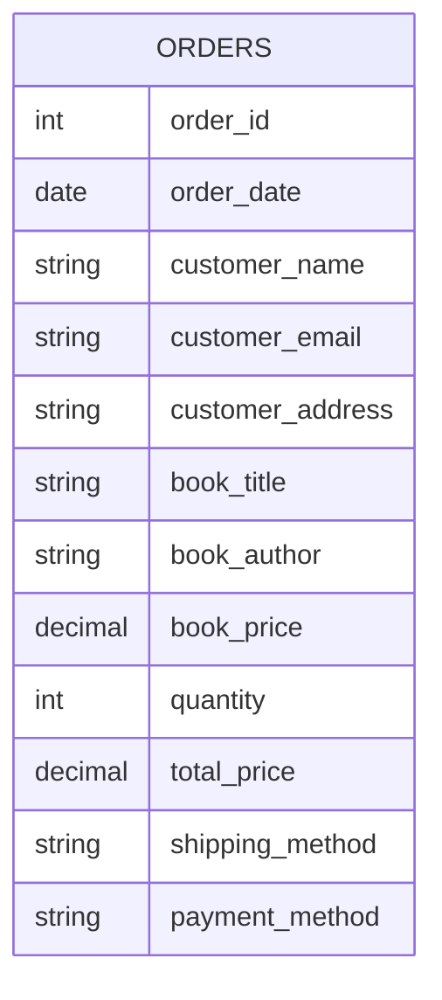
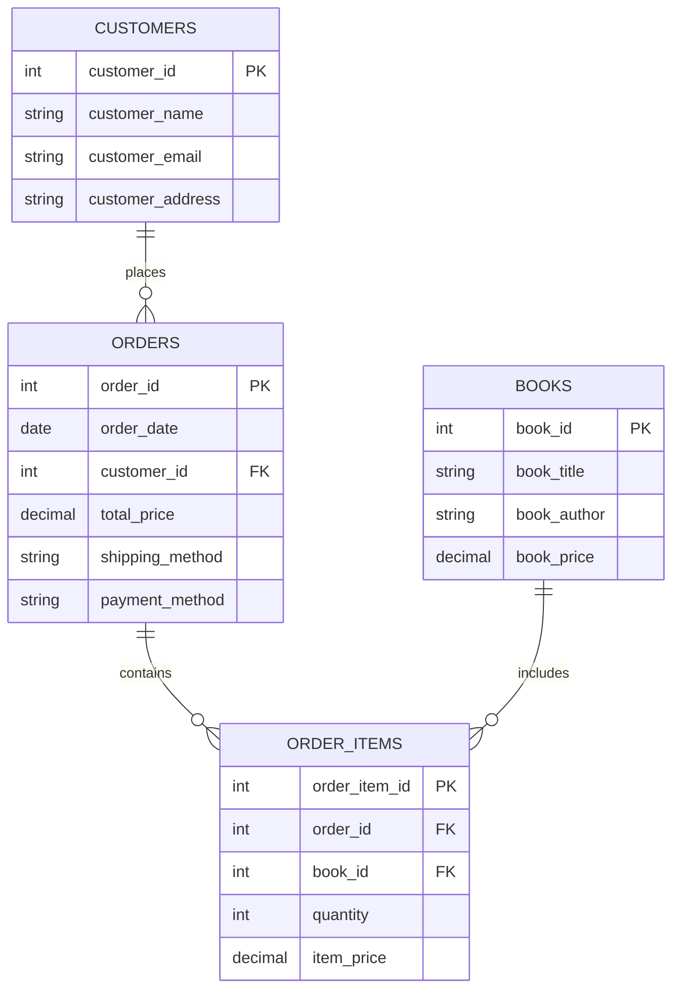
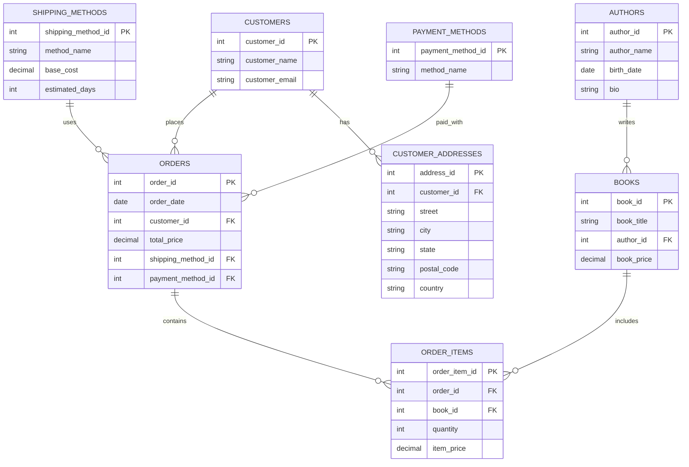
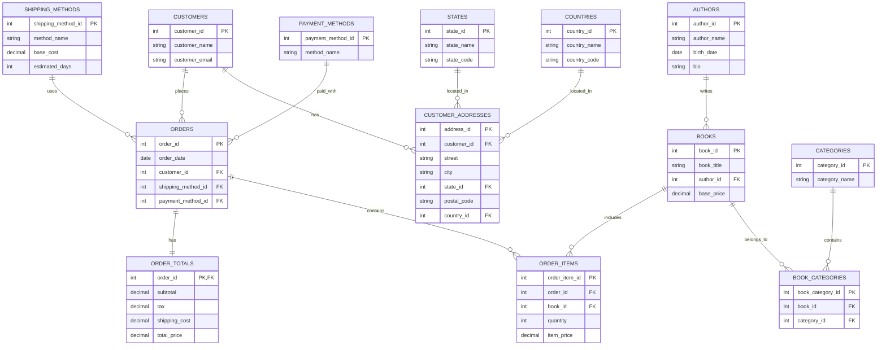

# Database Normalization Illustrated

Database normalization is the process of structuring a database according to a series of normal forms to reduce data redundancy and improve data integrity. This document uses Mermaid diagrams to visualize the transformation of database schemas through the normalization process.

## Example: Online Bookstore Database

Let's start with an unnormalized table for an online bookstore and see how normalization improves its structure.

### Unnormalized Form

### First Normal Form (1NF)
- Eliminate repeating groups
- Create separate tables for each set of related data
- Identify each set of related data with a primary key

### Second Normal Form (2NF)
- Meet all requirements of 1NF
- Remove subsets of data that apply to multiple rows of a table and place them in separate tables
- Create relationships between these new tables and their predecessors through foreign keys

### Third Normal Form (3NF)
- Meet all requirements of 2NF
- Remove columns that are not dependent on the primary key

## Benefits of Normalization

1. **Minimizes Redundancy**: Less duplicate data means less storage space required.
2. **Improves Data Integrity**: Reduces the risk of data inconsistencies.
3. **Better Query Performance**: For complex queries and updates.
4. **More Flexible Database Design**: Makes it easier to extend the database structure.
5. **Reduces Update Anomalies**: Prevents errors when inserting, updating, or deleting data.

## Drawbacks to Consider

1. **Increased Complexity**: More tables mean more joins in queries.
2. **Performance Impact**: Excessive normalization can negatively impact read performance for some operations.
3. **Development Overhead**: More tables can increase development time and complexity.

Remember that normalization is a guideline, not a strict rule. In real-world applications, controlled denormalization might be applied for performance optimization.
