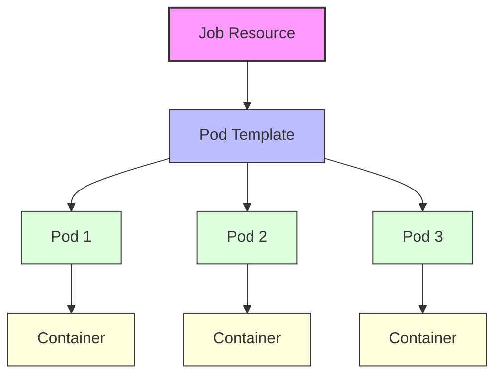
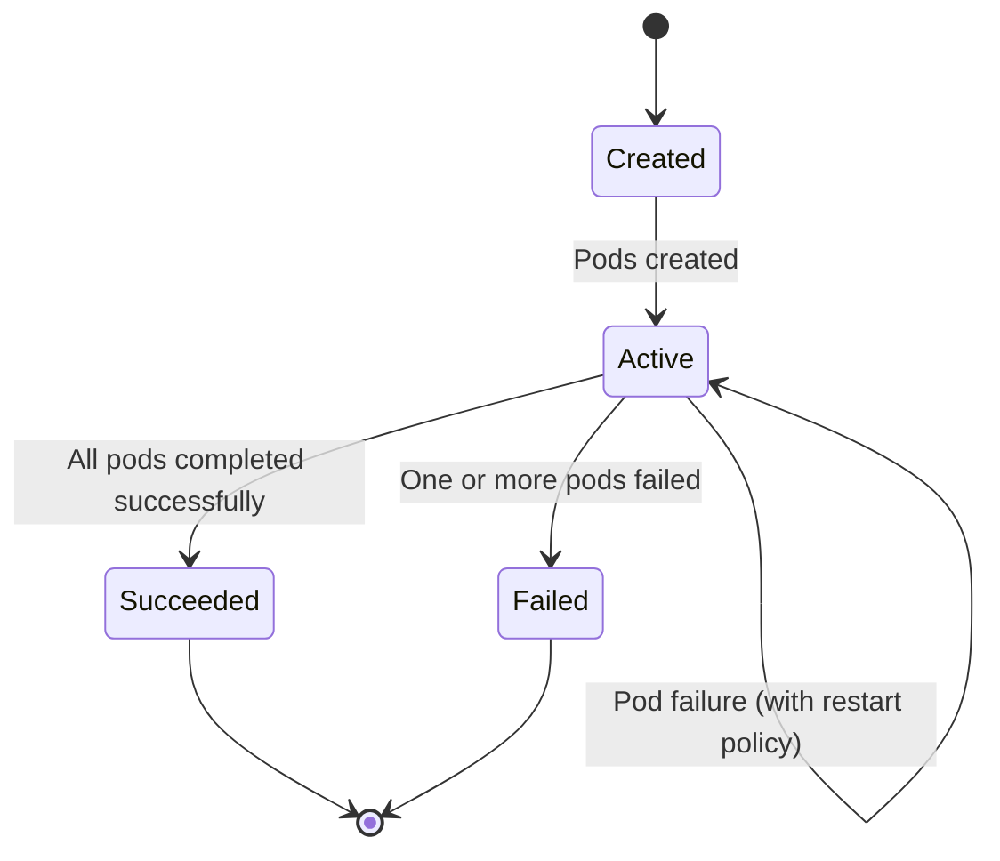
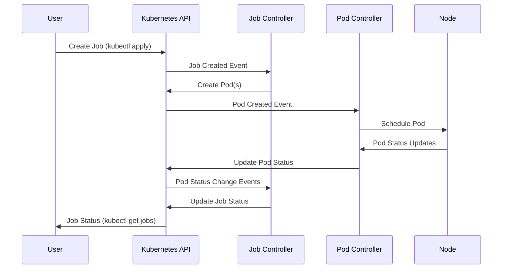
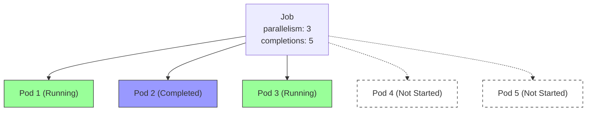
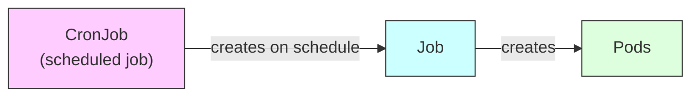

# Kubernetes Job Workload Explained

This document uses Mermaid diagrams to explain how a Kubernetes Job works.

## Basic Job Structure

## Job Lifecycle

## Job Control Flow

## Job Parallelism and Completions

Kubernetes Jobs allow you to control how many pods run in parallel and how many successful completions are required before the job is considered complete. These are managed by two key fields:

- **parallelism**: The maximum number of pods that can run at the same time. This allows you to process multiple tasks concurrently, improving throughput for batch workloads.
- **completions**: The total number of successful pod completions required for the job to finish. Each time a pod completes successfully, the job controller counts it toward this total.

### How It Works

- If `parallelism` is less than `completions`, Kubernetes will create new pods as others complete, ensuring that no more than `parallelism` pods are running at once, until the total number of successful completions reaches the `completions` value.
- If `parallelism` is equal to or greater than `completions`, all pods may be created and run at the same time.
- If a pod fails and the job's `backoffLimit` is not reached, Kubernetes will create a replacement pod to try again, until the required number of completions is achieved or the job fails.

### Example

Suppose you have a job with `parallelism: 3` and `completions: 5`:
- At most 3 pods will run at the same time.
- As soon as a pod completes, a new one is started (if needed) until 5 pods have completed successfully.

This setup is useful for parallelizing batch jobs, such as processing files, running tests, or performing data transformations, where you want to control both concurrency and total work done.

## Key Components Explained

- **Job Resource**: The Kubernetes object that manages the batch workload
- **Pod Template**: Specification for pods created by the job
- **Parallelism**: Maximum number of pods that can run in parallel
- **Completions**: Total number of successful pod completions required
- **BackoffLimit**: Number of retries allowed before the job is marked as failed
- **ActiveDeadlineSeconds**: Time limit for the job execution

## Common Use Cases

1. **Batch Processing**: Running finite data processing tasks
2. **Migration Scripts**: Database migrations or data transformations
3. **CI/CD Tasks**: Build, test, and deployment operations
4. **Initialization Tasks**: One-time setup operations

## Job vs CronJob

