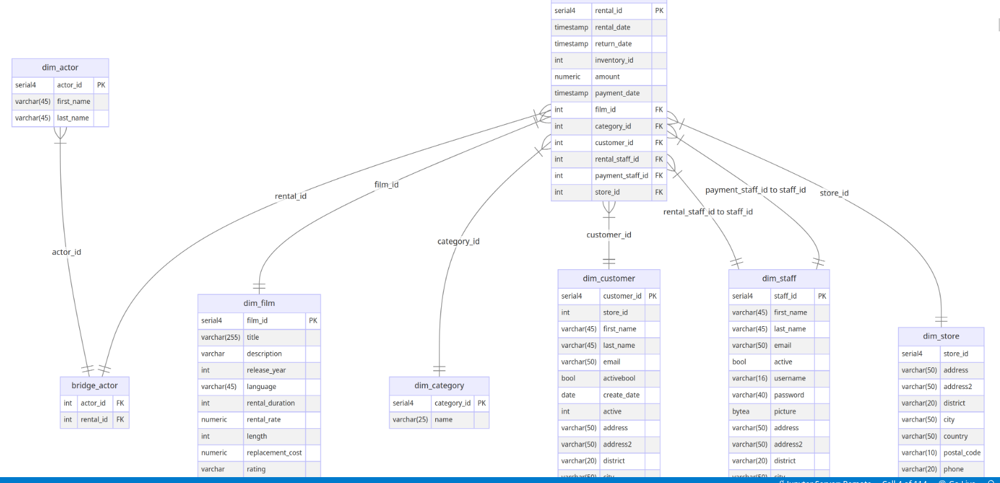

### ER




### Exercise 1

Write an SQL query to get the total amount obtained from the renting of Travel, Family, and Children films during the months of June and July of 2005. Present the results grouped and ordered by store id and category name.

- You can start by filling in the section starting from the keyword `FROM`. You will need to join `fact_rental` and `dim_category` tables by the `category_id` column.
- To filter required records, fill in the section after the clause `WHERE`. To get the three different category names, you can pass an [array](https://www.tutorialspoint.com/passing-an-array-to-a-query-using-where-clause-in-mysql) `('Travel', 'Family', 'Children')`. The `rental_date` should be [`BETWEEN`](https://www.w3schools.com/mysql/mysql_between.asp) `'2005-06-01'` and `'2005-08-01'`. Note that you will need to use the `AND` clause between those two conditions.
- Group by the `store_id` and the category name and order by the same two columns.
- Fill in the section after the `SELECT` clause to show `store_id`, category name and `SUM()` of the `amount`.

*Note*: Remember that a good practice when exploring your tables for the first time is to set a `LIMIT`, mostly if you want to get all columns from a table with the `*` wildcard.

```sql
SELECT
    store_id,
    dim_category.name AS category_name,
    SUM(amount) AS total_amount
FROM
    fact_rental
    INNER JOIN dim_category ON dim_category.category_id = fact_rental.category_id
WHERE
    dim_category.name IN ('Travel', 'Family', 'Children')
    AND fact_rental.rental_date BETWEEN '2005-06-01' AND '2005-08-01'
GROUP BY
    store_id,
    dim_category.name
ORDER BY
    store_id,
    dim_category.name;

```

#### Exercise 2.1 - (Optional)

You can start by creating a query to extract the `category_id` and `film_id` from the `fact_rental`. Use [`DISTINCT`](https://www.w3schools.com/sql/sql_distinct.asp) and `LIMIT`. To compare your results with the expected output, you can order by the `category_id` and `film_id`.


```sql
SELECT DISTINCT 
    category_id, 
    film_id
FROM
    fact_rental
ORDER BY
    category_id,
    film_id
LIMIT 10;
```
#### Exercise 2.2 - (Optional)

Let's practice writing Common Table Expressions (CTEs). Use optional exercise 2.1 without the `LIMIT` and `ORDER BY` statements as the code base to create a temporary result table named `film_category`. From the CTE `film_category`, select the `category_id` and aggregate the number of films in each category using the `COUNT()` function. Name the output column as `films`. Perform grouping by `category_id`. To check your result against the expected output, add the `ORDER BY` column `category_id` and `LIMIT` for the top 10 rows.

```sql
WITH film_category AS (
    SELECT DISTINCT 
        category_id,
        film_id
    FROM
        fact_rental
)
SELECT
    category_id,
    count(film_id) AS films
FROM
    film_category
GROUP BY
    category_id
ORDER BY
    category_id
LIMIT 10;

```

To calculate the average number of unique films from all categories, `average_by_category`, use the CTE `film_category_count`, averaging all the film counts with the `AVG()` function applied to `films` column.

```sql
WITH film_category AS (
    SELECT DISTINCT 
        category_id,
        film_id
    FROM
        fact_rental
),
film_category_count AS (
    SELECT
        category_id,
        count(film_id) AS films
    FROM
        film_category
    GROUP BY
        category_id
    ORDER BY
        category_id
)
SELECT
    avg(films) AS average_by_category
FROM
    film_category_count;

```

#### Exercise 2.4 - (Graded)

Use the query from the optional exercise 2.3. Wrap the last part into a CTE with the name `films_average_by_category`. From `films_average_by_category` select `average_by_category`, and also apply the `FLOOR()` and `CEIL()` functions to `average_by_category` to create separate columns for each function's result. This will give you the final output.

```sql
WITH film_category AS (
    SELECT DISTINCT 
        category_id,
        film_id
    FROM
        fact_rental
),
film_category_count AS (
    SELECT
        category_id,
        count(film_id) AS films
    FROM
        film_category
    GROUP BY
        category_id
    ORDER BY
        category_id
),
films_average_by_category AS (
    SELECT
        avg(films) AS average_by_category
    FROM
        film_category_count
)
SELECT
    average_by_category,
    FLOOR(average_by_category) AS floor_average,
    CEIL(average_by_category) AS ceil_average
FROM
    films_average_by_category;

```


#### Exercise 3.1 - (Optional)

Start by using the following two CTEs from the previous exercise 2: `film_category` and `film_category_count`. Then from the `film_category_count` CTE, select the average number of films, but enclose this result inside the `CEIL` function. Name this result as `average_by_category`.

```sql
WITH film_category AS (
    SELECT DISTINCT 
        category_id,
        film_id
    FROM fact_rental
        
),
film_category_count AS (
    SELECT
        category_id,
        count(film_id) AS films
    FROM
        film_category
    GROUP BY
        category_id
    ORDER BY
        category_id
)
SELECT
    CEIL(avg(films)) AS avergate_by_category
FROM
    film_category_count;
```

#### Exercise 3.2 - (Optional)

Use the same two CTEs `film_category` and `film_category_count`. Then, select all columns from `film_category_count`. Create a condition where you will compare the `films` column with the result of the main query that you created in the previous optional exercise 3.1, but now you will use it as a subquery and you won't need to rename the column as `average_by_category`.

```sql
WITH film_category AS (
    SELECT DISTINCT 
        category_id,
        film_id
    FROM fact_rental
),
film_category_count AS (
    SELECT
        category_id,
        count(film_id) AS films
    FROM
        film_category
    GROUP BY
        category_id
    ORDER BY
        category_id
)
SELECT
    * 
FROM
    film_category_count
WHERE
    films > (SELECT CEIL(avg(films)) FROM film_category_count);
```


#### Exercise 3.3 - (Graded)

In the previous optional exercise, you've got nearly the final result, but now you need to load the category names instead of the IDs.
- Take the query from the optional exercise 3.2.
- Delete `ORDER BY` statements in both of the CTEs.
- Add `INNER JOIN` statement into the CTE `film_category` joining the `fact_rental` table with the table `dim_category` based on the `category_id`. In the same CTE change the selection of `category_id` to `dim_category.category_id` and add `dim_category.name category,` to pull the category name as a `category` column.
- In the CTE `film_category_count` select also `category` in addition to `category_id`.
- In the very last selection exchange `*` with the `category` and `films`. You can also add `ORDER BY` statement using `category` column.

This should give you the final result.

```sql
WITH film_category AS (
    SELECT DISTINCT 
        dim_category.category_id,
        dim_category.name AS category,
        film_id
    FROM
        fact_rental
        INNER JOIN dim_category ON dim_category.category_id = fact_rental.category_id
),
film_category_count AS (
    SELECT
        category_id,
        category,
        count(film_id) AS films
    FROM
        film_category
    GROUP BY
        category_id
)
SELECT
    category,
    films
FROM
    film_category_count
WHERE
    films > (
        SELECT
            ceil(avg(films))
        FROM
            film_category_count
    )
ORDER BY
    category;
```


### Exercise 4

Write an SQL query to get the maximum purchase amount by customers on `2007-04-30` between `15:00` and `16:00`. Obtain the customer's full name in capital letters, the maximum purchase amount, and the payment date. Then, create a column called `value_rate`, and assign the `low` label if the amount is between 0 and 3, the `mid` label if it is between 3 and 6, and the `high` label if it is above 6. Sort by the maximum purchase amount in descending order and full name in ascending order.

```sql

SELECT
    CONCAT(UPPER(first_name), ' ', UPPER(last_name)) AS full_name,
    MAX(amount) AS max_amount,
    DATE(payment_date) AS payment_date,
    CASE
        WHEN MAX(amount) BETWEEN 0 AND 3 THEN 'low'
        WHEN MAX(amount) BETWEEN 3 AND 6 THEN 'mid'
        WHEN MAX(amount) > 6 THEN 'high'
    END AS value_rate
FROM
    fact_rental
    INNER JOIN dim_customer ON dim_customer.customer_id = fact_rental.customer_id
WHERE
    payment_date BETWEEN '2007-04-30 15:00:00' AND '2007-04-30 16:00:00'
GROUP BY
    dim_customer.customer_id,
    DATE(payment_date)
ORDER BY
    max_amount DESC,
    full_name ASC
;

```
Obtain from the colum "payment_date" the date without hours, use DATE() function and name the resulting column as "payment_date". Constrain your results to the date times between '2007-04-30 15:00:00' and '2007-04-30 16:00:00'. Remember to group by the customer identifier and by the payment_date (only date, without hours)
```sql

Select DATE(payment_date, '%Y-%m-%d') as payment_date

```


### Exercise 4.1 - (Optional)s
Start by creating a query to extract from the `fact_rental` table these columns: the customer ID, the maximum `amount` named as `max_amount` (use function `MAX()`) and from `payment_date` column get only the date without hours. Use function `DATE()` naming the resulting column as `payment_date`. Constrain your results to the date times between '2007-04-30 15:00:00' and '2007-04-30 16:00:00'. Remember to group by the customer identifier and by the `payment_date`(only date, without hours, so the `DATE()` function should be applied there as well).

Limit the output to 10 records just for this optional exercise.


```

SELECT
    customer_id,
    max(amount) AS max_amount,
    DATE(payment_date) AS payment_date
FROM
    fact_rental
WHERE
    payment_date BETWEEN '2007-04-30 15:00:00'
    AND '2007-04-30 16:00:00'
GROUP BY
    customer_id,
    DATE(payment_date)
LIMIT 10;

```

#### Exercise 4.2 - (Graded)

Use the previous query as a CTE `max_amount_customer` (without the `LIMIT` statement). Then, create a query expression following these steps:
- Join the `dim_customer` table with the CTE result on the `customer_id` column.
- Review how [`CONCAT`](https://www.w3schools.com/sql/func_mysql_concat.asp) and [`UPPER`](https://www.w3schools.com/sql/func_mysql_upper.asp) functions are used in the `SELECT` statement to get the full name in capital letters.
- Extract the `max_amount` and `payment_date`.
- Use a `CASE WHEN` clause and compare the `max_amount` column with the corresponding values.
- Order by the `max_amount` in a descending way while order by `full_name` in an ascending way.

This should give you the expected final result.

```sql

%%sql
WITH max_amount_customer AS (
    SELECT
        customer_id,
        max(amount) AS max_amount,
        DATE(payment_date) AS payment_date
    FROM
        fact_rental
    WHERE
        payment_date BETWEEN '2007-04-30 15:00:00'
        AND '2007-04-30 16:00:00'
    GROUP BY
        customer_id,
        DATE(payment_date)
)
SELECT
    CONCAT(
        UPPER(dim_customer.first_name),
        ' ',
        UPPER(dim_customer.last_name)
    ) AS full_name,
    max_amount,
    payment_date,
    CASE
        WHEN max_amount >= 0
        AND max_amount < 3 THEN 'low'
        WHEN max_amount >= 3
        AND max_amount < 6 THEN 'mid'
        WHEN max_amount >= 6 THEN 'high'
    END AS value_rate
FROM
    max_amount_customer
    INNER JOIN dim_customer ON dim_customer.customer_id = max_amount_customer.customer_id
ORDER BY
    max_amount DESC,
    full_name ASC;

```

### Exercise 5

Based on rental orders, write an SQL query to get the customer's full name, film category, and payment amount by customer and film category. Sort the results by the customer's full name, film category, and payment amount in ascending order.

- Use the `fact_rental` table as the main table for the queries. You will have to join with two additional tables in the following way:
  - Join `fact_rental` with `dim_customer` by the `customer_id`.
  - Join `fact_rental` with `dim_category` by the `category_id`.
  - All joins must be inner joins.
- In the `SELECT` clause, use the `CONCAT` function to join the first and last name of each customer.
- Select the `dim_category.name` as `category` and sum the `amount` column, naming it as `amount`.
- Group by `full_name` and `category` columns; order by `full_name`,  `category` and `amount`.
- Limit your results to 30 rows.


```sql
SELECT
    CONCAT(UPPER(dim_customer.first_name), ' ', UPPER(dim_customer.last_name)) AS full_name,
    dim_category.name AS category,
    SUM(fact_rental.amount) AS amount
FROM
    fact_rental
    INNER JOIN dim_customer ON dim_customer.customer_id = fact_rental.customer_id
    INNER JOIN dim_category ON dim_category.category_id = fact_rental.category_id
GROUP BY
    full_name,
    category
ORDER BY
    full_name,
    category,
    amount
LIMIT 30;

```

### Exercise 6

Using previous results, write an SQL query to create a pivot table that shows the total amount spent for each customer in each category. Also, fill the null values with a 0.

- Use the query from the previous exercise as a CTE (without the `LIMIT` statement); name it as `customer_category_sum`.
- In the query expression select the `full_name` of each customer. Then, for each category, use a `MAX()` function combined with a `CASE WHEN` statement to select the `amount` for that category or return 0 if the category doesn't match. For example, if the category is `Family`, the statement should look like `MAX(CASE WHEN category = 'Family' THEN amount ELSE 0 END) AS "Family"`.
- Group and order by the customer's `full_name`.
- Limit your results to 10 rows.

This approach ensures that each customer's total spending in each category is accurately pivoted into separate columns.

```sql
%%sql
WITH customer_category_sum AS (
    SELECT
        CONCAT(
            dim_customer.first_name,
            ' ',
            dim_customer.last_name
        ) AS full_name,
        dim_category.name AS category,
        sum(fact_rental.amount) AS amount
    FROM
        fact_rental
        INNER JOIN dim_customer ON dim_customer.customer_id= fact_rental.customer_id
        INNER JOIN dim_category ON dim_category.category_id = fact_rental.category_id
    GROUP BY
        full_name,
        category
    ORDER BY
        full_name,
        category,
        amount
)
SELECT
    full_name,
    MAX(
        CASE
            WHEN category = 'Family' THEN amount
            ELSE 0
        END
    ) AS "Family",
    MAX(
        CASE
            WHEN category = 'Games' THEN amount
            ELSE 0
        END
    ) AS "Games",
    MAX(
        CASE
            WHEN category = 'Animation' THEN amount
            ELSE 0
        END
    ) AS "Animation",
    MAX(
        CASE
            WHEN category = 'Classics' THEN amount
            ELSE 0
        END
    ) AS "Classics",
    MAX(
        CASE
            WHEN category = 'Documentary' THEN amount
            ELSE 0
        END
    ) AS "Documentary",
    MAX(
        CASE
            WHEN category = 'Sports' THEN amount
            ELSE 0
        END
    ) AS "Sports",
    MAX(
        CASE
            WHEN category = 'New' THEN amount
            ELSE 0
        END
    ) AS "New",
    MAX(
        CASE
            WHEN category = 'Children' THEN amount
            ELSE 0
        END
    ) AS "Children",
    MAX(
        CASE
            WHEN category = 'Music' THEN amount
            ELSE 0
        END
    ) AS "Music",
    MAX(
        CASE
            WHEN category = 'Travel' THEN amount
            ELSE 0
        END
    ) AS "Travel"
FROM
    customer_category_sum
GROUP BY
    full_name
ORDER BY
    full_name
LIMIT 10;

```


### Exercise 7

Write an SQL query to get the customers who made a payment on `2007-04-30` between `15:00` and `16:00`. Get the customer id and create a column that shows `On time` if the rental return was within the borrow time limit, and `Late` if it was overdue.

- You will need to join the `fact_rental` table with:
  - `dim_customer` table on the `customer_id`.
  - `dim_film` table on the `film_id`.
- At the `SELECT` clause add `dim_customer.customer_id`. Then use a `CASE WHEN` statement to differentiate between the `On time` and `Late` rentals. In that statement, you will use the `TIMEDIFF` function to compare the return and rental dates. Use the `EXTRACT` function to get the hour from the previous result:

    ```sql
    EXTRACT(HOUR FROM TIMEDIFF(fact_rental.return_date, fact_rental.rental_date))
    ```

  Compare this with the `rental_duration` from the `dim_film` table. Take into account that extracting the hour from a `TIMEDIFF` will give you a result in hours, while the rental duration is in days so you will have to multiply the rental duration by 24 to keep the same units.
- Filter your results so that the `fact_rental.payment_date` was BETWEEN `2007-04-30 15:00:00` and `2007-04-30 16:00:00`.
- Order your results by the `dim_customer.customer_id`.

```sql
%%sql
SELECT
    dim_customer.customer_id,
    CASE
        WHEN (EXTRACT(HOUR FROM timediff(fact_rental.return_date, fact_rental.rental_date))) > dim_film.rental_duration * 24 THEN 'Late'
        ELSE 'On time'
    END AS delivery    
FROM
    fact_rental
    INNER JOIN dim_customer ON dim_customer.customer_id = fact_rental.customer_id
    INNER JOIN dim_film ON dim_film.film_id = fact_rental.film_id
WHERE
    fact_rental.payment_date BETWEEN '2007-04-30 15:00:00'
    AND '2007-04-30 16:00:00'
ORDER BY
    dim_customer.customer_id
;

```

<a id='ex08'></a>
### Exercise 8

Write an SQL query to get the initials of the staff using the `first_name` and `last_name` columns. Use `CONCAT()` function to join the substrings.

*Example*: John Lennon -> JL

```sql
SELECT
    CONCAT(
        UPPER(SUBSTRING(first_name, 1, 1)),
        UPPER(SUBSTRING(last_name, 1, 1))
    ) AS initials
FROM
    dim_staff

```


#### Exercise 9.1 - (Optional)

Join the `fact_rental` and `dim_film` tables through the `film_id`, and select the film `title` and `rating` from `dim_film`. Then take the `SUM()` of the `fact_rental.amount` column as `amount`. Group by `title` and `rating`. Limit your result to 10 rows.

```sql
SELECT
    dim_film.title,
    dim_film.rating,
    SUM(fact_rental.amount) AS amount

FROM
    fact_rental
    INNER JOIN dim_film ON dim_film.film_id = fact_rental.film_id
GROUP BY
    dim_film.title,
    dim_film.rating
LIMIT 10;

```

#### Exercise 9.2 - (Optional)

Create a CTE named `movies_amount_rating` with the previous query (without the `LIMIT` statement). As query expression, select the `title`, `rating`, `amount` and use the [`RANK()`](https://www.geeksforgeeks.org/mysql-ranking-functions/) window function to assign a rank to each row based on a partition over the `rating` and ordered by the `amount` in descending order. Name this last column as `rank_movies`. Limit your results to 10.

```sql
%%sql
WITH movies_amount_rating AS(
    SELECT
        dim_film.title,
        dim_film.rating,
        SUM(fact_rental.amount) AS amount
    FROM
        fact_rental
        INNER JOIN dim_film ON fact_rental.film_id = dim_film.film_id
    GROUP BY
        title,
        rating
)
SELECT
    title,
    rating,
    amount,
    RANK() over (
        PARTITION BY rating
        ORDER BY
            amount DESC
    ) AS rank_movies
FROM
    movies_amount_rating
LIMIT 10;

```

#### Exercise 9.3 - (Graded)

Create a new CTE named `movies_ranking` with the previous query expression (do not include the `LIMIT`); you should have 2 CTEs at this point. As a query expression, select the `title`, `rating`, `amount` from `movies_ranking`; filter to get only the `rank_movies` equals to 1. This will give you the final result for this exercise.


```sql

%%sql
WITH movies_amount_rating AS(
    SELECT
        dim_film.title,
        dim_film.rating,
        SUM(fact_rental.amount) AS amount
    FROM
        fact_rental
        INNER JOIN dim_film ON dim_film.film_id = fact_rental.film_id
    GROUP BY
        title,
        rating
),
movies_ranking AS (
    SELECT
        title,
        rating,
        amount,
        RANK() over (
            PARTITION BY rating
            ORDER BY
                amount DESC
        ) AS rank_movies
    FROM
        movies_amount_rating
)
SELECT
    title,
    rating,
    amount
FROM
    movies_ranking
WHERE
    rank_movies = 1;

```


#### Exercise 10.1 - (Optional)

Use the `dim_actor` as the main table for this query. Perform the following joins:
* `dim_actor` and `bridge_actor` table on the `actor_id`.
* `fact_rental` and `bridge_actor` on the `rental_id`.
* `dim_film` and `fact_rental` on the `film_id`.

Then, select the distinct `dim_actor.actor_id`, `dim_actor.first_name`, `dim_actor.last_name` and `dim_film.film_id` combinations. Limit your results to 20 rows; To compare with the expected output, you can order by `dim_actor.actor_id` and `dim_film.film_id`.


```sql

%%sql
SELECT DISTINCT 
    dim_actor.actor_id,
    dim_actor.first_name,
    dim_actor.last_name,
    dim_film.film_id
FROM
    dim_actor
    INNER JOIN bridge_actor ON dim_actor.actor_id = bridge_actor.actor_id
    INNER JOIN fact_rental ON fact_rental.rental_id =bridge_actor.rental_id
    INNER JOIN dim_film ON fact_rental.film_id = dim_film.film_id
ORDER BY
    dim_actor.actor_id,
    dim_film.film_id
LIMIT 20;


```

#### Exercise 10.2 - (Optional)

Create a CTE with the previous query and name it `actor_film` (without the `ORDER BY` and `LIMIT` statements). Then, in the query expression select the `actor_id`, `first_name`, `last_name` and count the number of films from the `actor_film` CTE result with the function `COUNT(*)` giving the column name `films`. Remember to group by the `actor_id`. Limit your results to 10 rows. To compare with the expected output, you can order by `actor_id`.

```sql
%%sql
WITH actor_film AS (
    SELECT DISTINCT 
        dim_actor.actor_id,
        dim_actor.first_name,
        dim_actor.last_name,
        dim_film.film_id
    FROM
        dim_actor    
        INNER JOIN bridge_actor ON dim_actor.actor_id = bridge_actor.actor_id
        INNER JOIN fact_rental ON fact_rental.rental_id = bridge_actor.rental_id
        INNER JOIN dim_film ON fact_rental.film_id = dim_film.film_id
)
SELECT
    actor_id,
    first_name,
    last_name,
    COUNT(*) AS films
FROM
    actor_film
GROUP BY
    actor_id
ORDER BY
    actor_id
    LIMIT 10;
```


#### Exercise 10.3 - (Optional)

Alongside the `actor_film` CTE, add the previous query as `actor_film_count` (without the `ORDER BY` and `LIMIT` statements). In the query expression, select the actor's first and last name (`first_name` and `last_name`), also the count of films `films` and use the `ROW_NUMBER()` window function over a window ordered by the film count in descending order and by the first and last name in ascending order; name this column as `actor_rank`. Limit this result to 10.
```sql
%%sql
WITH actor_film AS (
    SELECT DISTINCT 
        dim_actor.actor_id,
        dim_actor.first_name,
        dim_actor.last_name,
        dim_film.film_id
    FROM
        dim_actor    
        INNER JOIN bridge_actor ON dim_actor.actor_id = bridge_actor.actor_id
        INNER JOIN fact_rental ON fact_rental.rental_id = bridge_actor.rental_id
        INNER JOIN dim_film ON fact_rental.film_id = dim_film.film_id
),
actor_film_count AS (
SELECT
    actor_id,
        first_name,
        last_name,
        COUNT(*) AS films
FROM
    actor_film
GROUP BY
    actor_id
)
SELECT
    first_name,
    last_name,
    films,
    ROW_NUMBER() over (
        ORDER BY
           films DESC, first_name, last_name ASC
    ) AS actor_rank
FROM
    actor_film_count
LIMIT 10;
```

#### Exercise 10.4 - (Graded)

Create a third CTE statement named `actors_rank` using the previous query expression (without the `LIMIT` statement). Then, select all columns from the `actors_rank` result and filter by the top 10 actors with the help of the `actor_rank` column. Order by `actor_rank` in ascending way. This will give the final result for this exercise.

```sql
%%sql
WITH actor_film AS (
    SELECT DISTINCT 
        dim_actor.actor_id,
        dim_actor.first_name,
        dim_actor.last_name,
        dim_film.film_id
    FROM
        dim_actor    
        INNER JOIN bridge_actor ON dim_actor.actor_id = bridge_actor.actor_id
        INNER JOIN fact_rental ON fact_rental.rental_id = bridge_actor.rental_id
        INNER JOIN dim_film ON fact_rental.film_id = dim_film.film_id
),
actor_film_count AS (
SELECT
    actor_id,
        first_name,
        last_name,
        COUNT(*) AS films
FROM
    actor_film
GROUP BY
    actor_id
),
actors_rank AS (
SELECT
    first_name,
    last_name,
    films,
    ROW_NUMBER() over (
        ORDER BY
           films DESC, first_name, last_name ASC
    ) AS actor_rank
FROM
    actor_film_count
)
SELECT
    *
FROM
    actors_rank
WHERE
    actor_rank <= 10
ORDER BY
    actor_rank ASC;

```

#### Exercise 11.1 - (Optional)

Taking the `fact_rental` table, use the `EXTRACT()` function to obtain the `MONTH` from the `payment_date` column. Then, name the new column as `month`. Use the `SUM()` function over the column `amount` and name the resulting column as `amount`. Filter the corresponding `customer_id` and where `payment_date` is `NOT NULL`. Group by `month`. Order by `month` to compare with the expected output.

```sql
%%sql
SELECT
    EXTRACT(MONTH FROM payment_date) AS month,
    SUM(amount) AS amount
FROM
    fact_rental
WHERE
    customer_id = 388
  AND payment_date IS NOT NULL
GROUP BY
    month
ORDER BY
    month
```

#### Exercise 11.2 - (Graded)

With the previous query, create a CTE named `total_payment_amounts_sum` (do not include the `ORDER BY` statement). In the query expression, extract the `month` and `amount` columns. Then, use the [`LAG`](https://www.geeksforgeeks.org/mysql-lead-and-lag-function/) function and set the first parameter as the `amount` column and the second parameter as 1; this function will work over a window ordered by month and this should be named `previous_month_amount`.
Take the difference between the result of the `LAG` function with the same parameters and over the same window, and the current value of `amount`. Set the name for this value as `difference`. This will give you the final result for this exercise.

```sql
%%sql
WITH total_payment_amounts_sum AS (
    SELECT
        EXTRACT(MONTH FROM payment_date) AS month,
        SUM(amount) AS amount
    FROM
        fact_rental
    WHERE
        customer_id = 388
        AND payment_date IS NOT NULL
    GROUP BY
        month
)
SELECT
    month,
    amount,
    LAG(amount, 1) OVER (
    ORDER BY
    month
    ) AS previous_month_amount,
    LAG(amount, 1) OVER (
    ORDER BY
    month
    ) - amount AS difference
FROM
    total_payment_amounts_sum;

```

<a id='ex12'></a>
#### Exercise 12

Filtering rental orders with payments, write an SQL query to get the amount spent by month of the `customer_id` `388`. Get the total amount of the current month and the total amount of the next month (name it as `next_month_amount`), then calculate the difference between those values.

To complete this exercise, you can follow the same process as in the previous exercise, but change the `LAG` function with the `LEAD` function.

```sql
%%sql

WITH total_payment_amounts_sum AS (
    SELECT
        EXTRACT(MONTH FROM payment_date) AS month,
        SUM(amount) AS amount
    FROM
        fact_rental
    WHERE
        customer_id = 388
        AND payment_date IS NOT NULL
    GROUP BY
        month
)
SELECT
    month,
    amount,
    LEAD(amount, 1) OVER (
        ORDER BY
            month
    ) AS next_month_amount,
    LEAD(amount, 1) OVER (
        ORDER BY
            month
    ) - amount AS difference
FROM
    total_payment_amounts_sum;

```

