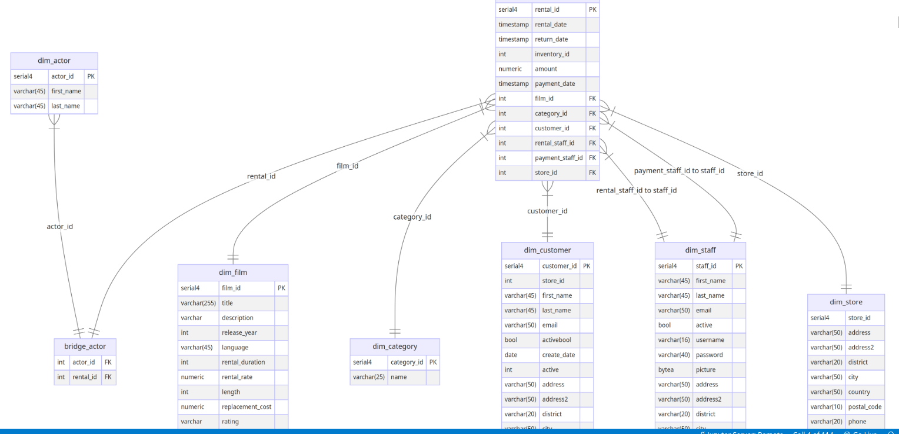

### ER




### Exercise 1

Write an SQL query to get the total amount obtained from the renting of Travel, Family, and Children films during the months of June and July of 2005. Present the results grouped and ordered by store id and category name.

- You can start by filling in the section starting from the keyword `FROM`. You will need to join `fact_rental` and `dim_category` tables by the `category_id` column.
- To filter required records, fill in the section after the clause `WHERE`. To get the three different category names, you can pass an [array](https://www.tutorialspoint.com/passing-an-array-to-a-query-using-where-clause-in-mysql) `('Travel', 'Family', 'Children')`. The `rental_date` should be [`BETWEEN`](https://www.w3schools.com/mysql/mysql_between.asp) `'2005-06-01'` and `'2005-08-01'`. Note that you will need to use the `AND` clause between those two conditions.
- Group by the `store_id` and the category name and order by the same two columns.
- Fill in the section after the `SELECT` clause to show `store_id`, category name and `SUM()` of the `amount`.

*Note*: Remember that a good practice when exploring your tables for the first time is to set a `LIMIT`, mostly if you want to get all columns from a table with the `*` wildcard.

```sql
SELECT
    store_id,
    dim_category.name AS category_name,
    SUM(amount) AS total_amount
FROM
    fact_rental
    INNER JOIN dim_category ON dim_category.category_id = fact_rental.category_id
WHERE
    dim_category.name IN ('Travel', 'Family', 'Children')
    AND fact_rental.rental_date BETWEEN '2005-06-01' AND '2005-08-01'
GROUP BY
    store_id,
    dim_category.name
ORDER BY
    store_id,
    dim_category.name;

```

#### Exercise 2.1 - (Optional)

You can start by creating a query to extract the `category_id` and `film_id` from the `fact_rental`. Use [`DISTINCT`](https://www.w3schools.com/sql/sql_distinct.asp) and `LIMIT`. To compare your results with the expected output, you can order by the `category_id` and `film_id`.


```sql
SELECT DISTINCT 
    category_id, 
    film_id
FROM
    fact_rental
ORDER BY
    category_id,
    film_id
LIMIT 10;
```
#### Exercise 2.2 - (Optional)

Let's practice writing Common Table Expressions (CTEs). Use optional exercise 2.1 without the `LIMIT` and `ORDER BY` statements as the code base to create a temporary result table named `film_category`. From the CTE `film_category`, select the `category_id` and aggregate the number of films in each category using the `COUNT()` function. Name the output column as `films`. Perform grouping by `category_id`. To check your result against the expected output, add the `ORDER BY` column `category_id` and `LIMIT` for the top 10 rows.

```sql
WITH film_category AS (
    SELECT DISTINCT 
        category_id,
        film_id
    FROM
        fact_rental
)
SELECT
    category_id,
    count(film_id) AS films
FROM
    film_category
GROUP BY
    category_id
ORDER BY
    category_id
LIMIT 10;

```

To calculate the average number of unique films from all categories, `average_by_category`, use the CTE `film_category_count`, averaging all the film counts with the `AVG()` function applied to `films` column.

```sql
WITH film_category AS (
    SELECT DISTINCT 
        category_id,
        film_id
    FROM
        fact_rental
),
film_category_count AS (
    SELECT
        category_id,
        count(film_id) AS films
    FROM
        film_category
    GROUP BY
        category_id
    ORDER BY
        category_id
)
SELECT
    avg(films) AS average_by_category
FROM
    film_category_count;

```

#### Exercise 3.1 - (Optional)

Start by using the following two CTEs from the previous exercise 2: `film_category` and `film_category_count`. Then from the `film_category_count` CTE, select the average number of films, but enclose this result inside the `CEIL` function. Name this result as `average_by_category`.

```sql
WITH film_category AS (
    SELECT DISTINCT 
        category_id,
        film_id
    FROM fact_rental
        
),
film_category_count AS (
    SELECT
        category_id,
        count(film_id) AS films
    FROM
        film_category
    GROUP BY
        category_id
    ORDER BY
        category_id
)
SELECT
    CEIL(avg(films)) AS avergate_by_category
FROM
    film_category_count;
```

#### Exercise 3.2 - (Optional)

Use the same two CTEs `film_category` and `film_category_count`. Then, select all columns from `film_category_count`. Create a condition where you will compare the `films` column with the result of the main query that you created in the previous optional exercise 3.1, but now you will use it as a subquery and you won't need to rename the column as `average_by_category`.

```sql
WITH film_category AS (
    SELECT DISTINCT 
        category_id,
        film_id
    FROM fact_rental
),
film_category_count AS (
    SELECT
        category_id,
        count(film_id) AS films
    FROM
        film_category
    GROUP BY
        category_id
    ORDER BY
        category_id
)
SELECT
    * 
FROM
    film_category_count
WHERE
    films > (SELECT CEIL(avg(films)) FROM film_category_count);
```


#### Exercise 3.3 - (Graded)

In the previous optional exercise, you've got nearly the final result, but now you need to load the category names instead of the IDs.
- Take the query from the optional exercise 3.2.
- Delete `ORDER BY` statements in both of the CTEs.
- Add `INNER JOIN` statement into the CTE `film_category` joining the `fact_rental` table with the table `dim_category` based on the `category_id`. In the same CTE change the selection of `category_id` to `dim_category.category_id` and add `dim_category.name category,` to pull the category name as a `category` column.
- In the CTE `film_category_count` select also `category` in addition to `category_id`.
- In the very last selection exchange `*` with the `category` and `films`. You can also add `ORDER BY` statement using `category` column.

This should give you the final result.

```sql
WITH film_category AS (
    SELECT DISTINCT 
        dim_category.category_id,
        dim_category.name AS category,
        film_id
    FROM
        fact_rental
        INNER JOIN dim_category ON dim_category.category_id = fact_rental.category_id
),
film_category_count AS (
    SELECT
        category_id,
        category,
        count(film_id) AS films
    FROM
        film_category
    GROUP BY
        category_id
)
SELECT
    category,
    films
FROM
    film_category_count
WHERE
    films > (
        SELECT
            ceil(avg(films))
        FROM
            film_category_count
    )
ORDER BY
    category;
```
