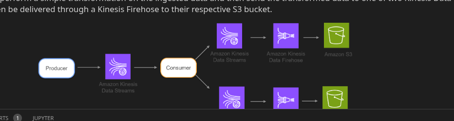

### Data Ingestion 

Using glue etl ingested some files to s3 week

### Week2

Troubleshooting
and insert data directly to rds

Data ingestion on a continium

### Batch Ingestion
ETL vs ELT
[etl => Original bath pattern. raw-data then transform then you use destination]

[elt => extract load transform]

it's faster to implement
It makes data available more quickly to end users.
Tansformation can still be done efficiently

Batch- semi-frequent
Microbatch-frequent
Straming very frequent

### Producers:

Push data to kinesis data streams

1 Stream => N shard

size and rate of write and read operations TO obtain the number of shards.
each shard up to 5 read operations=> 2MB read

write 1MB per second

### Kinesis on-demand mode

Scalling up or down.
charly only when you use
More convenient from an operation perspective

Provisioned mode:

### Data record

Parition key, sequence number, BLOB
parition key => wich shard

### Diagram ETL

